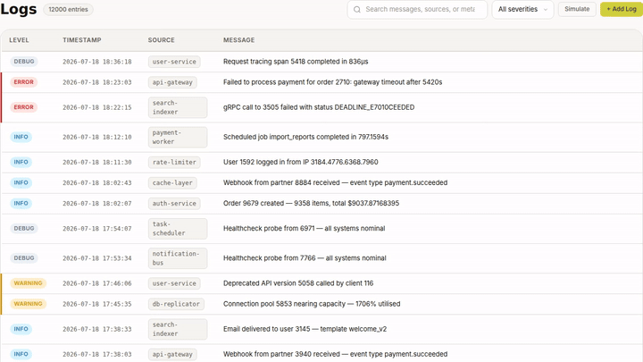
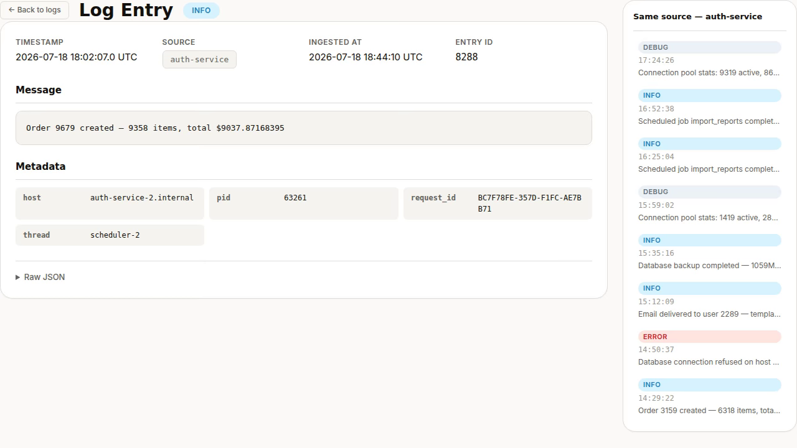
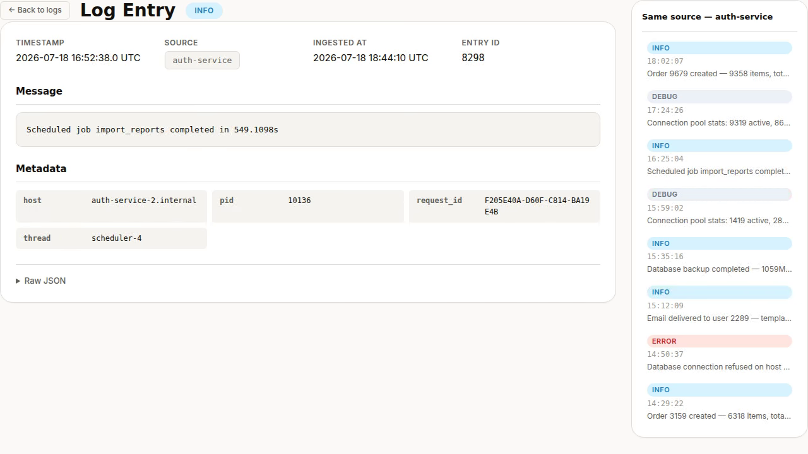
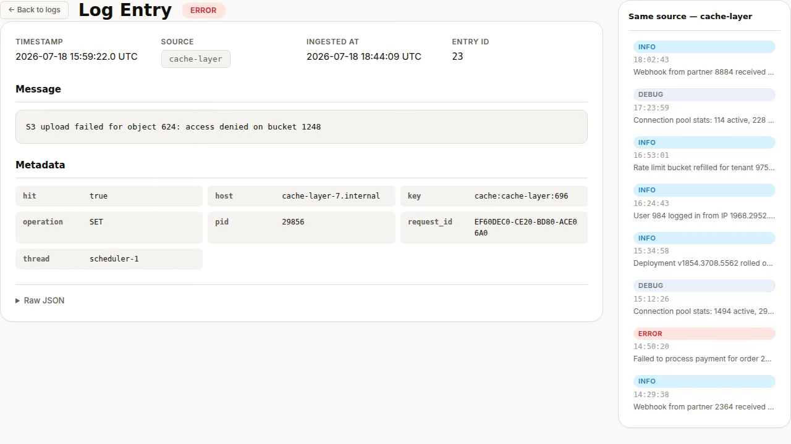

# Drift — open-source log monitoring dashboard

**Drift** is a free, open-source log monitoring dashboard built with Elixir/Phoenix. A log viewer and observability application built with Phoenix LiveView. Run it locally, deploy it as a self-hosted monitoring dashboard, or [remix it on cenius.ai](https://cenius.ai/marketplace/p/drift?ref=gh&utm_campaign=drift-phoenix) to make it your own — the whole application (code, design, seeded demo data) ships in this repository under the MIT license.

[](LICENSE)  [](https://cenius.ai)

## Demo



▶ **[Watch the full demo video](https://cenius.ai/marketplace/p/drift?ref=gh&utm_campaign=drift-phoenix)** — the complete walkthrough, playing on the project's cenius.ai page · [MP4 file](.github/media/demo.mp4)

## Screenshots

  

## Features

- Log Listing with Severity
- Filter and Search
- Log Detail View
- Live Tail
- Light/Dark Theme Toggle

## Quick start

```bash
./install.sh   # installs dependencies + seeds demo data
```

See [`INSTALL.md`](INSTALL.md) for full setup and usage instructions.

## Usage guide

Once the server is running (`mix phx.server`), open your browser to `http://localhost:4000`.

### Web Interface

#### Log List

The main interface is a LiveView page that lists all log entries. Navigate to:

- **`/logs`** – View all log entries with their severity levels (debug, info, warning, error).

The log list provides a modern, responsive UI with light and dark mode support.

#### Log Detail

Click on any log entry in the list to view its full details:

- **`/logs/:id`** – Displays the complete data of a single log entry.

Both views are implemented as LiveView modules:
- `lib/drift_web/live/log_list_live.ex`
- `lib/drift_web/live/log_detail_live.ex`

with corresponding templates:
- `lib/drift_web/live/log_list_live.html.heex`
- `lib/drift_web/live/log_detail_live.html.heex`

#### Features

- **Severity levels** are color‑coded and filterable.
- **Dark/light mode** can be toggled from the UI (if implemented in the layout components).
- **Seeded demo data** is available out of the box (generated by `priv/repo/seeds.exs`).

### API (if available)

A `LogController` (`lib/drift_web/controllers/log_controller.ex`) may provide additional endpoints, but no RESTful routes are explicitly documented in the provided files. Use the web interface for the primary interaction.

### Customisation

- To add custom fonts, set the `FONTS_DIR` environment variable as described in `INSTALL.md`.
- The Tailwind configuration is at `assets/tailwind.config.js`; styles can be extended there.

_Full guide: [`USAGE.md`](USAGE.md)_

## Architecture

Elixir/Phoenix application, delivered as a complete, runnable project (53 files). Top-level layout: `assets/`, `config/`, `lib/`, `priv/`, `test/`. `install.sh` provisions dependencies and seeds demo data, so the app boots with something to show. Setup details live in [`INSTALL.md`](INSTALL.md).

## FAQ

### How do I self-host Drift?

Everything you need ships in this repo: clone it, run `./install.sh` to install dependencies and seed demo data, then follow [`INSTALL.md`](INSTALL.md) to start it. No external services required.

### What powers Drift under the hood?

The app is built with Elixir/Phoenix. What you see in this repo is the full production source, demo data included. Highlights include light/Dark Theme Toggle.

### Is Drift free for commercial use?

Yes — it ships under the MIT license, which permits commercial use, modification and redistribution. The full text is in [LICENSE](LICENSE).

### Is white-labeling Drift allowed?

Absolutely. [Open it on cenius.ai](https://cenius.ai/marketplace/p/drift?ref=gh&utm_campaign=drift-phoenix) and remix it there — platform modifications come with full rebrand and relicense rights over your derivative, so the result is entirely yours.

### Can I change Drift without writing code?

Yes — [load it on cenius.ai](https://cenius.ai/marketplace/p/drift?ref=gh&utm_campaign=drift-phoenix), describe the change in plain English, and you get back a new downloadable build with the modification applied.

## License & rebranding

Released under the [MIT License](LICENSE) (© 2026 Cenius AI) — free for personal and commercial use.

**Need a customized version?** [Remix this app on cenius.ai](https://cenius.ai/marketplace/p/drift?ref=gh&utm_campaign=drift-phoenix) — modifications made on the platform come with **full rebrand & relicense rights** over your derivative.

## Built with cenius.ai

This entire application — code, design, seeded demo data — was generated on **[cenius.ai](https://cenius.ai)** from a plain-English description.

- 🚀 [Build your own app on cenius.ai](https://cenius.ai)
- 🎛️ [Remix Drift on the marketplace](https://cenius.ai/marketplace/p/drift?ref=gh&utm_campaign=drift-phoenix) — open it in a workspace, prompt for changes, and ship your own version.

More open-source apps: [the Cenius-ai catalog](https://github.com/Cenius-ai) · [showcase index](https://github.com/Cenius-ai/showcase)
